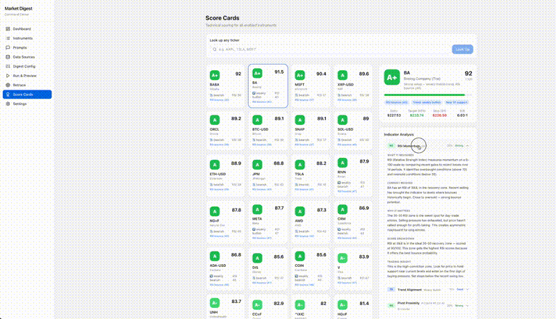
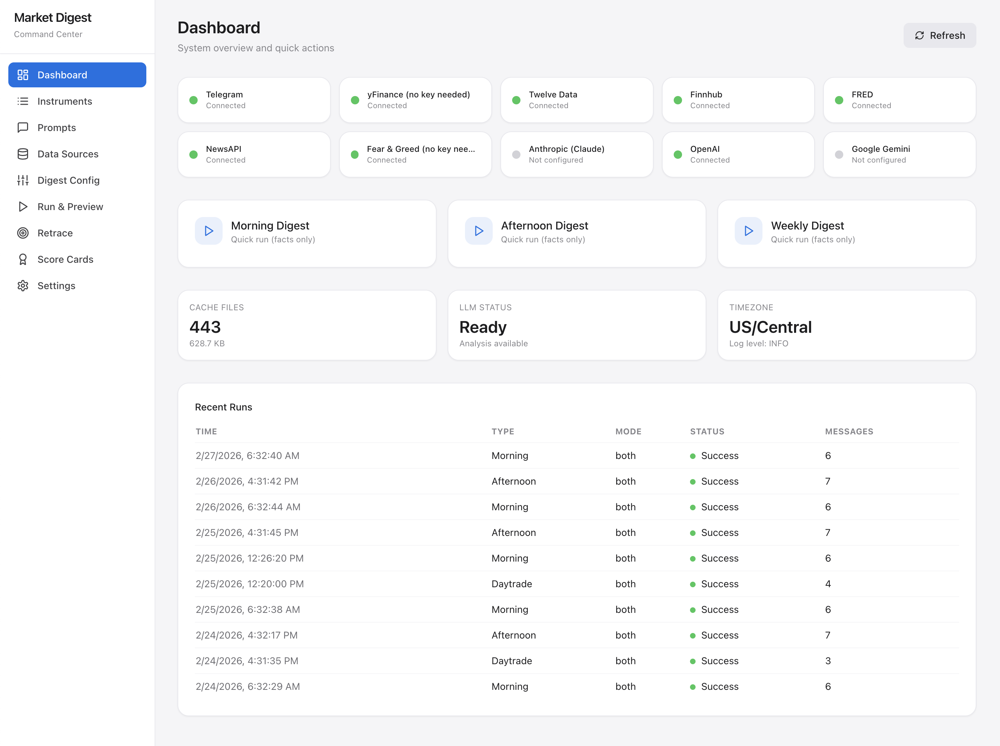
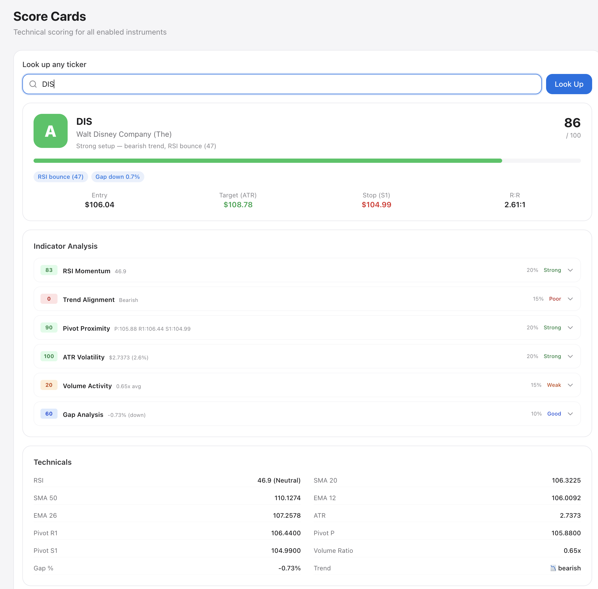
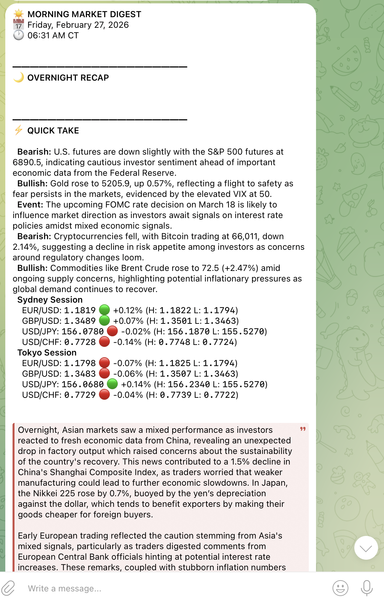
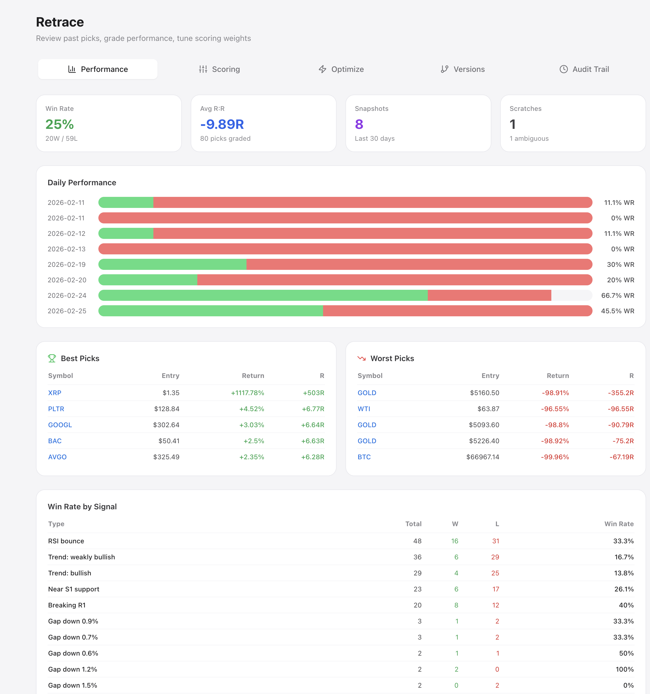

<div align="center">

# Market Digest

**Your entire pre-market routine — automated, scored, and delivered to Telegram.**

[](https://github.com/mutaafaziz/market-digest/stargazers)
[](LICENSE)
[](https://python.org)
[](https://github.com/mutaafaziz/market-digest/actions)

Tired of checking 6 platforms before market open?<br>
Market Digest grabs live data, scores every instrument from 0–100, and texts you the results.<br>
Then it tracks which picks actually hit — so your analysis gets better over time.

<!-- TODO: Add demo GIF here. See assets/screenshots/README.md for recording instructions. -->
<!--  -->

</div>

---

## What You Get

| | |
|---|---|
| **📱 Wake up to a scored market brief** | Morning, afternoon, weekly, and day trade digests land on your phone via Telegram — automatically. |
| **🎯 See exactly where to enter, target, and stop** | Every instrument scored 0–100 across daily, weekly, and monthly timeframes. Entry, target, and stop levels included. |
| **📊 Track which picks actually hit** | The Retrace system snapshots every pick and grades it against real prices. See your win rate. Tune your weights. |
| **🧠 Optional AI commentary** | Add Claude, GPT-4o, or Gemini for context — or run pure data with zero API keys. |
| **🏗️ A full Command Center in your browser** | Configure instruments, preview digests, view multi-timeframe scorecards, and track performance — all from a React web UI. |
| **🔒 100% self-hosted, 100% yours** | No cloud. No subscription. No data leaves your machine unless you send it to Telegram. |

---

## See It In Action

<details>
<summary><strong>📸 Command Center Dashboard</strong></summary>

<!-- TODO: Screenshot of the Command Center home page showing API health indicators -->
<!--  -->

*Capture this: Open the web UI at localhost:8550. Show the home page with API health dots and digest controls visible.*

</details>

<details>
<summary><strong>📊 Multi-Timeframe ScoreCard</strong></summary>

<!-- TODO: Screenshot of a ScoreCard detail panel -->
<!--  -->

*Capture this: Click into any instrument's ScoreCard. Show the grade badge (A+ through F), entry/target/stop levels, RSI zones, and fundamentals panel for a stock.*

</details>

<details>
<summary><strong>📱 Telegram Digest</strong></summary>

<!-- TODO: Screenshot of a Telegram message on your phone -->
<!--  -->

*Capture this: Open Telegram on your phone. Find a real digest message. Crop to show the formatted output with scored picks.*

</details>

<details>
<summary><strong>🔄 Retrace Performance</strong></summary>

<!-- TODO: Screenshot of the Retrace tracking page -->
<!--  -->

*Capture this: Open the Retrace page in the web UI. Show the win rate and pick performance history.*

</details>

---

## Get Running in 60 Seconds

```bash
git clone https://github.com/mutaafaziz/market-digest.git
cd market-digest
./setup.sh
make ui
```

That's it. The setup script creates a virtual environment, installs everything, and walks you through API keys (all optional). `make ui` builds the frontend and opens the Command Center at [localhost:8550](http://localhost:8550).

**Want to see a digest right now?** No API keys needed:

```bash
make digest-dry
```

This runs a day trade digest in your terminal using free yfinance data.

<details>
<summary><strong>🐳 Docker alternative</strong></summary>

```bash
git clone https://github.com/mutaafaziz/market-digest.git
cd market-digest
cp .env.example .env    # Edit .env with your API keys (optional)
docker compose up --build
```

Open [localhost:8550](http://localhost:8550).

</details>

<details>
<summary><strong>🪟 Windows</strong></summary>

```powershell
git clone https://github.com/mutaafaziz/market-digest.git
cd market-digest
.\setup.bat
```

Then start the UI:

```powershell
.venv\Scripts\python scripts\start_ui.py
```

</details>

<details>
<summary><strong>🛠️ Manual setup</strong></summary>

```bash
git clone https://github.com/mutaafaziz/market-digest.git
cd market-digest

# Python
python3 -m venv .venv
source .venv/bin/activate          # Windows: .venv\Scripts\activate
pip install -r requirements.txt

# Environment
cp .env.example .env               # Edit with your keys (all optional)

# Frontend
cd ui/frontend && npm install && npm run build && cd ../..

# Launch
python scripts/start_ui.py
```

</details>

---

## How It Works

```
  6 Data Sources          Analysis Engine          Delivery
┌──────────────┐      ┌──────────────────┐      ┌──────────────┐
│  yfinance    │      │  RSI / MACD      │      │              │
│  TwelveData  │─────▶│  Pivot Points    │─────▶│   Telegram   │
│  Finnhub     │      │  Trend Detection │      │   (phone)    │
│  FRED        │      │  Scoring (0-100) │      │              │
│  NewsAPI     │      │  Fundamentals    │      ├──────────────┤
│  Fear & Greed│      │  AI Commentary   │      │   Web UI     │
└──────────────┘      └──────────────────┘      │  (browser)   │
                                                └──────────────┘
```

Market Digest pulls live data from 6 free sources, runs technical analysis across 3 timeframes (daily, weekly, monthly), scores every instrument from 0–100 using weighted composites (RSI, trend, pivot proximity, volatility, volume, gaps), and sends you a formatted digest.

For stocks, it also scores fundamentals — valuation, profitability, growth, and financial health — so long-term grades factor in both technicals and business quality.

The Retrace system snapshots every day trade digest, then compares your picks against actual next-day prices. Over time, you see which scoring weights work best and adjust them.

---

## What You Can Track

84 instruments pre-configured across 7 categories:

| Category | Examples | Count |
|----------|----------|-------|
| US Stocks | AAPL, NVDA, TSLA, META, JPM, LLY, PLTR | 48 |
| US Indices | S&P 500, NASDAQ, Dow Jones, VIX | 6 |
| Forex | EUR/USD, GBP/USD, USD/JPY | 8 |
| Commodities | Gold, Oil, Natural Gas, Coffee, Copper | 14 |
| Crypto | BTC, ETH, SOL, XRP, ADA | 5 |
| Futures | ES, NQ, YM | 3 |
| Economic | Fed Rate, CPI, GDP, Unemployment (via FRED) | 8 |

Add or remove instruments anytime through the web UI or by editing `config/instruments.yaml`.

---

## API Keys — What's Free, What's Optional

**Market Digest works out of the box with zero API keys.** yfinance provides all core price data for free, no signup needed.

| Service | Required? | Free Tier | What It Adds |
|---------|-----------|-----------|--------------|
| yfinance | Built-in | Free, no key | Core prices, fundamentals — always available |
| [Telegram](https://t.me/BotFather) | For delivery | Free | Digest delivery to your phone |
| [TwelveData](https://twelvedata.com) | No | 800 calls/day | Real-time and intraday prices |
| [Finnhub](https://finnhub.io) | No | 60 calls/min | Earnings calendar, economic events |
| [FRED](https://fred.stlouisfed.org/docs/api/api_key.html) | No | Unlimited | Fed rate, GDP, CPI, unemployment |
| [NewsAPI](https://newsapi.org) | No | 100 calls/day | Financial news headlines |
| [Anthropic](https://console.anthropic.com) / [OpenAI](https://platform.openai.com) / [Gemini](https://aistudio.google.com) | No | Varies | AI commentary on digests |

Add keys to `.env` as you go. Each one unlocks more data. The setup script walks you through it interactively.

---

## The Command Center — Web UI

Start it with `make ui` and open [localhost:8550](http://localhost:8550). Ten pages:

| Page | What It Does |
|------|-------------|
| **Dashboard** | Home page with API health status and quick actions |
| **Digest** | Preview and send any digest type (morning, afternoon, weekly, day trade) |
| **Instruments** | Add, remove, or toggle the 84 tracked instruments |
| **ScoreCard** | Multi-timeframe scorecards — daily, weekly, monthly grades for every instrument |
| **Weights** | Tune scoring weights (RSI, trend, pivot, volatility, volume, gaps, fundamentals) |
| **Prompts** | Edit LLM prompt templates for each digest section |
| **Retrace** | Pick performance tracking — see which calls hit their targets |
| **Settings** | Timezone, digest preferences, delivery config |
| **Cache** | View and clear the dual-tier cache |
| **Logs** | Browse digest history and runtime logs |

**Access from your phone:** Open `http://<your-LAN-IP>:8550` on any device on your network.

---

## Automate It — Set and Forget

Schedule digests to run automatically so they're waiting on your phone when you wake up.

<details>
<summary><strong>macOS (launchd)</strong></summary>

```bash
make schedule-install
```

This creates scheduled jobs for:
- **Morning brief** — 6:30 AM CT
- **Day trade picks** — 8:15 AM CT
- **Afternoon recap** — 4:30 PM CT
- **Weekly summary** — Friday 5:30 PM CT

</details>

<details>
<summary><strong>Linux (systemd)</strong></summary>

See [`systemd/README.md`](systemd/README.md) for service files and timer setup.

</details>

<details>
<summary><strong>Any platform (cron / Task Scheduler)</strong></summary>

Run any digest from the command line:

```bash
# Digest types: morning, afternoon, weekly, daytrade
# Modes: facts (data only), full (data + AI), both

.venv/bin/python scripts/run_digest.py --type daytrade --mode facts
.venv/bin/python scripts/run_digest.py --type morning --mode full
```

Point your OS scheduler (cron, Windows Task Scheduler, etc.) at these commands.

</details>

---

## Configuration

All config lives in YAML files under `config/`. Edit by hand or through the web UI — changes apply instantly.

| File | Controls |
|------|----------|
| `config/instruments.yaml` | Which instruments to track (tickers, names, categories) |
| `config/scoring.yaml` | Scoring weights for day trade, swing, and long-term timeframes |
| `config/prompts.yaml` | LLM prompt templates and AI provider settings |
| `config/digests.yaml` | Digest sections, modes, and delivery schedules |

---

## Architecture

```
┌─────────────────────────────────────────────────────────────┐
│                    Web UI (React + Vite)                     │
│              localhost:8550 — Command Center                 │
├─────────────────────────────────────────────────────────────┤
│                  FastAPI Server (60 endpoints)               │
├──────────┬──────────┬───────────┬───────────┬───────────────┤
│ Fetchers │ Analysis │  Digest   │  Retrace  │    Config     │
│ yfinance │ RSI/MACD │ Morning   │ Snapshot  │ instruments   │
│ 12Data   │ Pivots   │ Afternoon │ Grading   │ prompts       │
│ Finnhub  │ Trend    │ Weekly    │ Scoring   │ digests       │
│ FRED     │ Scoring  │ Daytrade  │ Tracking  │ scoring wts   │
│ NewsAPI  │ LLM      │ Formatter │           │               │
│ F&G      │ Fundmtls │           │           │               │
├──────────┴──────────┴───────────┴───────────┴───────────────┤
│          Cache (memory + JSON)  │  Telegram Delivery         │
└─────────────────────────────────┴───────────────────────────┘
```

---

## Project Structure

```
market-digest/
├── config/              # YAML configs (instruments, prompts, scoring weights)
├── src/
│   ├── analysis/        # Technical analysis, scoring, LLM, fundamentals
│   ├── cache/           # Dual-tier cache (memory + JSON files)
│   ├── delivery/        # Telegram delivery
│   ├── digest/          # Digest builders (morning, afternoon, weekly, daytrade)
│   ├── fetchers/        # Data fetchers (yfinance, TwelveData, Finnhub, etc.)
│   ├── retrace/         # Pick snapshot & grading system
│   └── utils/           # Logging, rate limiting, timezone helpers
├── ui/
│   ├── server.py        # FastAPI app (11 route groups)
│   ├── routes/          # API route handlers
│   └── frontend/        # React + TypeScript + Tailwind
├── scripts/             # CLI tools (run_digest, start_ui, setup_launchd, etc.)
├── tests/               # Test suite
├── logs/                # Runtime logs & retrace snapshots
└── cache/               # File-backed JSON cache
```

---

## Makefile Shortcuts

```bash
make setup          # Full setup (venv + deps + frontend build)
make ui             # Start the web UI
make dev            # Start with hot-reload (development)
make digest-dry     # Quick dry-run daytrade digest
make test           # Run tests
make lint           # Run linter
make clean          # Remove build artifacts and cache
make help           # Show all available targets
```

---

## Contributing

See [CONTRIBUTING.md](CONTRIBUTING.md) for development setup, code style, and how to add new features (fetchers, scoring dimensions, digest sections, API endpoints).

---

## License

[MIT](LICENSE) — do whatever you want with it.
